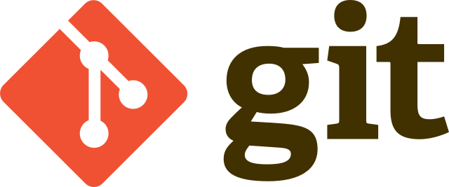

# Знакомство с контроль версий

__Что такое контроль версий и зачем он нужен?__

__Контроль версий__ - это практика отслеживания изменений программного кода и управления ими.

__Преимущества контроль версий.__

1. Полная история изменений каждого файла за длительный период.
2. Ветвление и слияние.
3. Отслеживаемость.

__Среди множества существующих систем управления версиями мы сосредоточимся на одной: системе *Git*.__

> Для полной информации перейдите по ссылке: [больше информации о Git](https://www.atlassian.com/ru/git/tutorials/what-is-version-control)

===
# Git команды:

__git init__ – инициализация локального репозитория.

__git status__ – получить информацию от git о его текущем состоянии.

__git add “path”__ – добавить файл или файлы к следующему коммиту.

__git add .__ - добавляет все файлы в проекте в отслеживание.

__*git commit -am “message”__ - git add + git commit.

__git commit -m “message”__ – создание коммита.

__git log__ – вывод на экран истории всех коммитов с их хеш-кодами.

__git checkout__ – переход от одного коммита к другому.

__git checkout master__ – вернуться к актуальному состоянию и продолжить работу.

__git diff__ – увидеть разницу между текущим файлом и закоммиченным файлом.

>[!Примечание]
>Работает только после 1-го ручного добавления в отслеживание.
---

# Синтаксис языка Markdown

___Markdown___ - это облегченный язык разметки с синтаксисом форматирования обычного текста.

__# Заголовок__ – выделение заголовков. Количество символов “#” задаёт уровень заголовка  (поддерживается 6 уровней).

__= или -__ – подчёркиванием этими символами (не менее 3 подряд) выделяют заголовки  первого (“=”) и второго (“-”) уровней.

____Полужирное начертание____ или ____Полужирное начертание____

__*Курсивное начертание*__ или ___Курсивное начертание___

__*__Полужирное курсивное начертание__*__

__~Зачёркнутый текст~*__

__* Строка__ – ненумерованные списки, символ “*” в начале строки

__1, 2, 3 …__ – нумерованные списки

>[!Примечание]
>Знак "~" должно прописаться дважды с двух сторон слова!

# Работа с ветками.

Создать ветку можно командой **git branch**.
Делать это надо в папке с репозиторием: 

* git branch <название новой ветки>

Если у нас несколько версий черновика, мы можем вывести на экран ветку, где находимся, командой **git branch**.

Если потребуется переключиться с одной ветки на другую, вызовем команду **git checkout <имя ветки>**

Когда мы правим текст/код в текущей ветке, автоматического слияния не происходит: можно создавать один документ в разных версиях в разных ветках. 

Команда git log покажет состояние более новых версий проекта. Но если вызвать эту команду из самой «свежей» ветки, мы не увидим исходного файла.

Создаем репозитори в Github

1. Создаем аккаунт в github
2. Создать локальный репозитории
3. Авторизоваться в github при первой загрузки локального репозитори.
4. Отправить локальный репозитори в github через команду git push.
5. Скачать удаленный репозитори из github через команду git pull

1. Делаем (fork) интересующего нас репозитория
2. мы делаем git clone для нашей версии этого репозитория
3. мы создаем ветку с предлагаемыми изменениями
4. ПРоизводим все изменения только в этой ветке
5. ОТправляем эти изменения на свой аккаунт (push)
6. В окне на Github появляется возможность отправить pull request
